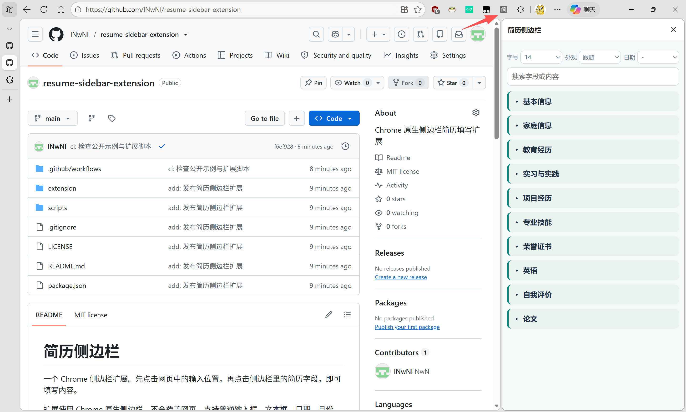

# 简历侧边栏

一个用于填写在线简历的 Chrome 侧边栏扩展。先点击网页中的输入位置，再点击侧边栏里的简历字段，即可填入内容。

扩展使用 Chrome 原生侧边栏，不会覆盖网页。它支持文本框、日期、月份、下拉选项、单选框、复选框、可编辑区域和 iframe。自动填写失败时，所选内容会复制到剪贴板；按住 Alt 点击字段也可以直接复制。



## 安装

1. 下载或克隆本仓库。
2. 在 Chrome 地址栏打开 `chrome://extensions`。
3. 打开右上角的“开发者模式”。
4. 点击“加载已解压的扩展程序”。
5. 选择本仓库中的 `extension` 文件夹。
6. 点击浏览器工具栏中的“简历侧边栏”图标。

如果招聘网页在安装扩展之前已经打开，请先刷新网页。

## 填写自己的简历

简历数据位于 [`extension/data.js`](extension/data.js)。可以按照现有示例直接修改，也可以让 AI 根据你的简历编辑这个文件。

普通文本字段：

```js
{ label: '姓名', value: '示例用户', kind: 'text' }
```

日期字段：

```js
{ ...date('2025-06-30'), label: '取得时间' }
```

时间范围：

```js
...period(date('2023-09-01'), date('2026-06-30'))
```

日期需要写到日。修改后，在 `chrome://extensions` 中点击扩展的“重新加载”。

## 使用

1. 点击网页中需要填写的输入框或选项。
2. 在侧边栏中展开分类和条目。
3. 点击要填写的字段。

侧边栏可以调整字号、外观和日期分隔符。原生日期控件仍使用浏览器要求的 `YYYY-MM-DD` 或 `YYYY-MM` 格式。

Element UI 的只读单日日期框可以点击后选择侧边栏中的日期；扩展会通过网页的年、月、日面板选择，并核对最终显示值。如果网页禁用了该日期或修改了日历结构，侧边栏会显示失败原因，需要手动选择。

## 兼容范围

扩展支持 Chrome 114 及以上版本。Chrome 内部页面、Chrome 应用商店、文件上传框、封闭 Shadow DOM，以及没有标准 HTML 或 ARIA 语义的自定义控件可能无法自动填写。

扩展不会自动提交表单，也不会向外部服务器发送简历数据。

## 许可证

MIT
